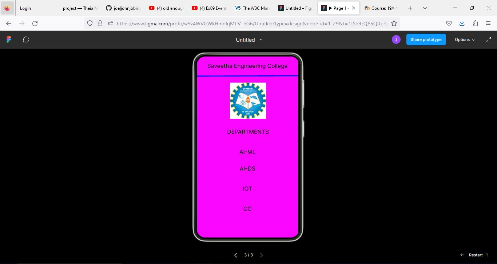

# Event Registration Web Application

## AIM:
To design, develop and deploy a web application for event registration.

## DESIGN STEPS:

### Step 1:
Create a new frame.

### Step 2:
Select any one preset sze of your choice.

### Step 3:
Select the shapes you need.

### Step 4:
Import images as needed.

### Step 5:
Create pages based on your need and link them.

### Step 6:
Validate the HTML and CSS code.

### Step 7:
Publish the website in the given URL.

## DESIGN:

## CODE :
```css
/* Home Page */

position: relative;
width: 360px;
height: 640px;

background: #FF1010;

/* Saveetha Engineering College */

position: absolute;
width: 339px;
height: 44px;
left: calc(50% - 339px/2 + 0.5px);
top: 20px;

font-family: 'Inter';
font-style: normal;
font-weight: 400;
font-size: 20px;
line-height: 24px;
text-align: center;

color: #FFFFFF;

/* Affiliated to Anna University */

position: absolute;
width: 339px;
height: 44px;
left: calc(50% - 339px/2 + 0.5px);
top: 257px;

font-family: 'Inter';
font-style: normal;
font-weight: 400;
font-size: 20px;
line-height: 24px;
text-align: center;

color: #FFFFFF;

/* NIRF Ranked Autonomous Insititution */

position: absolute;
width: 339px;
height: 44px;
left: calc(50% - 339px/2 + 0.5px);
top: 320px;

font-family: 'Inter';
font-style: normal;
font-weight: 400;
font-size: 20px;
line-height: 24px;
text-align: center;

color: #FFFFFF;

/* Line 1 */

position: absolute;
width: 360px;
height: 0px;
left: 0px;
top: 73px;

border: 4px solid #1019FF;
transform: rotate(-0.16deg);

/* logo 1 */

position: absolute;
width: 128px;
height: 128px;
left: 116px;
top: 96px;

background: url(logo.jpg);

/* Rectangle 1 */

position: absolute;
width: 195px;
height: 44px;
left: 83px;
top: 392px;

background: #3DFD1E;
box-shadow: 0px 4px 4px rgba(0, 0, 0, 0.25), 0px 4px 4px rgba(0, 0, 0, 0.25), 0px 4px 4px rgba(0, 0, 0, 0.25), 0px 4px 4px rgba(0, 0, 0, 0.25);

/* LOGIN */

position: absolute;
width: 168px;
height: 27px;
left: 96px;
top: 401px;

font-family: 'Inter';
font-style: normal;
font-weight: 400;
font-size: 20px;
line-height: 24px;
text-align: center;

color: #000000;

/* Login Page */

position: relative;
width: 360px;
height: 640px;

background: #EFF400;

/* Saveetha Engineering College */

position: absolute;
width: 334px;
height: 47px;
left: 13px;
top: 17px;

font-family: 'Inter';
font-style: normal;
font-weight: 400;
font-size: 20px;
line-height: 24px;
text-align: center;

color: #FF0A0A;

/* Line 2 */

position: absolute;
width: 360px;
height: 0px;
left: 0px;
top: 73px;

border: 4px solid #1019FF;
transform: rotate(-0.16deg);

/* logo 2 */

position: absolute;
width: 128px;
height: 128px;
left: 116px;
top: 89px;

background: url(logo.jpg);

/* Rectangle 2 */

position: absolute;
width: 215px;
height: 39px;
left: 68px;
top: 271px;

background: #08EBFA;

/* Rectangle 3 */

position: absolute;
width: 215px;
height: 39px;
left: 68px;
top: 359px;

background: #08EBFA;

/* Username */

position: absolute;
width: 196px;
height: 24px;
left: 68px;
top: 247px;

font-family: 'Inter';
font-style: normal;
font-weight: 400;
font-size: 20px;
line-height: 24px;

color: #000000;

/* Username */

position: absolute;
width: 196px;
height: 24px;
left: 68px;
top: 247px;

font-family: 'Inter';
font-style: normal;
font-weight: 400;
font-size: 20px;
line-height: 24px;

color: #000000;

/* Password */

position: absolute;
width: 196px;
height: 24px;
left: 68px;
top: 335px;

font-family: 'Inter';
font-style: normal;
font-weight: 400;
font-size: 20px;
line-height: 24px;

color: #000000;

/* Rectangle 2 */

position: absolute;
width: 215px;
height: 44px;
left: 68px;
top: 440px;

background: #3DFD1E;
box-shadow: 0px 4px 4px rgba(0, 0, 0, 0.25), 0px 4px 4px rgba(0, 0, 0, 0.25), 0px 4px 4px rgba(0, 0, 0, 0.25), 0px 4px 4px rgba(0, 0, 0, 0.25);

/* SUBMIT */

position: absolute;
width: 168px;
height: 27px;
left: 92px;
top: 448px;

font-family: 'Inter';
font-style: normal;
font-weight: 400;
font-size: 20px;
line-height: 24px;
text-align: center;

color: #000000;

/* SEC Page */

position: relative;
width: 358px;
height: 649px;

background: #FA07FF;

/* Saveetha Engineering College */

position: absolute;
width: 334px;
height: 47px;
left: 11px;
top: 21px;

font-family: 'Inter';
font-style: normal;
font-weight: 400;
font-size: 20px;
line-height: 24px;
text-align: center;

color: #000000;

/* DEPARTMENTS */

position: absolute;
width: 334px;
height: 47px;
left: 13px;
top: 254px;

font-family: 'Inter';
font-style: normal;
font-weight: 400;
font-size: 20px;
line-height: 24px;
text-align: center;

color: #000000;

/* AI-ML */

position: absolute;
width: 334px;
height: 47px;
left: 11px;
top: 325px;

font-family: 'Inter';
font-style: normal;
font-weight: 400;
font-size: 20px;
line-height: 24px;
text-align: center;

color: #000000;

/* AI-DS */

position: absolute;
width: 334px;
height: 47px;
left: 11px;
top: 384px;

font-family: 'Inter';
font-style: normal;
font-weight: 400;
font-size: 20px;
line-height: 24px;
text-align: center;

color: #000000;

/* IOT */

position: absolute;
width: 334px;
height: 47px;
left: 11px;
top: 455px;

font-family: 'Inter';
font-style: normal;
font-weight: 400;
font-size: 20px;
line-height: 24px;
text-align: center;

color: #000000;

/* CC */

position: absolute;
width: 334px;
height: 47px;
left: 11px;
top: 526px;

font-family: 'Inter';
font-style: normal;
font-weight: 400;
font-size: 20px;
line-height: 24px;
text-align: center;

color: #000000;

/* Line 3 */

position: absolute;
width: 360px;
height: 0px;
left: -2px;
top: 71px;

border: 4px solid #1019FF;
transform: rotate(-0.16deg);

/* logo 3 */

position: absolute;
width: 128px;
height: 128px;
left: 116px;
top: 92px;

background: url(logo.jpg);
```

## OUTPUT:




## Result:
The program to design, develop and deploy a web application for event registration is completed successfully.
